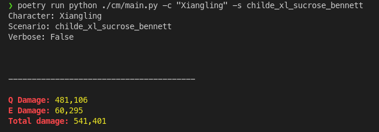

# **CM**: <ins>C</ins>alculator <ins>M</ins>ess

## **What is it?**

It's a highly complicated mess of a **Genshin Impact Damage Calculator** that isn't really better than sheets, but makes me much happier to fiddle with. It's also easier to check your math, since it doesn't really abstract much away, you can set it to verbose to print out numbers to double check, and all your assumptions are in one file.

## **Why does it exist?**

Sheets are horrible to work with. And sims and optimizers have become a plague with how people are unwilling to think when using them. I wanted a middle ground of ease of use, explicit assumptions, and verifiability.

## **How to use it?**

First, you should probably set it up.

### **Prerequisites**

You'll need to have Python at the very least. Here's the [official docs]( https://docs.python.org/3/using/index.html). Just check for the specific version you have. Or just [google it](https://letmegooglethat.com/?q=How+to+install+python).

You'll also need Poetry for package management and virtual environment shennanigans. The [installation process](ttps://python-poetry.org/docs/) is thankfully easier to understand.

After that, just run 

```bash
poetry install
```
which should install all the dependencies you need.

### **Running it**

To run a calc, you'll need two things

1. a python file in the `./cm/scenarios` folder with your scenario e.g. buffs, stats, etc
2. the name of the character from that scenario you'd like to calc

You should check the `./cm/scenarios` folder for requirement 1. You'll find some examples.

If you need help figuring out stats, there are also some rudimentary tools in `./utils/substat_calculator` and `./utils/er_calculator` to help. There's a quick writeup in the README for the substat calculator too on the general process that I do for figuring out substats.

Once you have both of those, just run

```bash
poetry run python ./cm/main.py -c "<character_name>" -s "<scenario>" 
```

For example, 




You can also add the `-v` flag to show the different numbers that were used for the calc.

You can use `-r <number of rotations>` to calculate for multiple rotations.

### **Schemas & Tests**

If your scenario fails to load, you may just have some missing fields. You can cross reference the error you got with the schemas in the `./cm/schemas` folder.

Also, if you ever plan on updating anything, there are some basic tests setup that'll confirm things are more or less still working. Just run

```bash
poetry run pytest
```

Type checking via mypy is also an option via

```bash
poetry run mypy cm
```